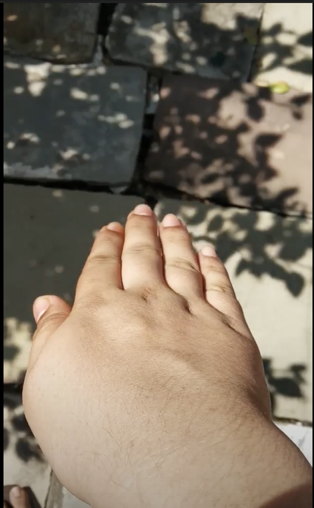
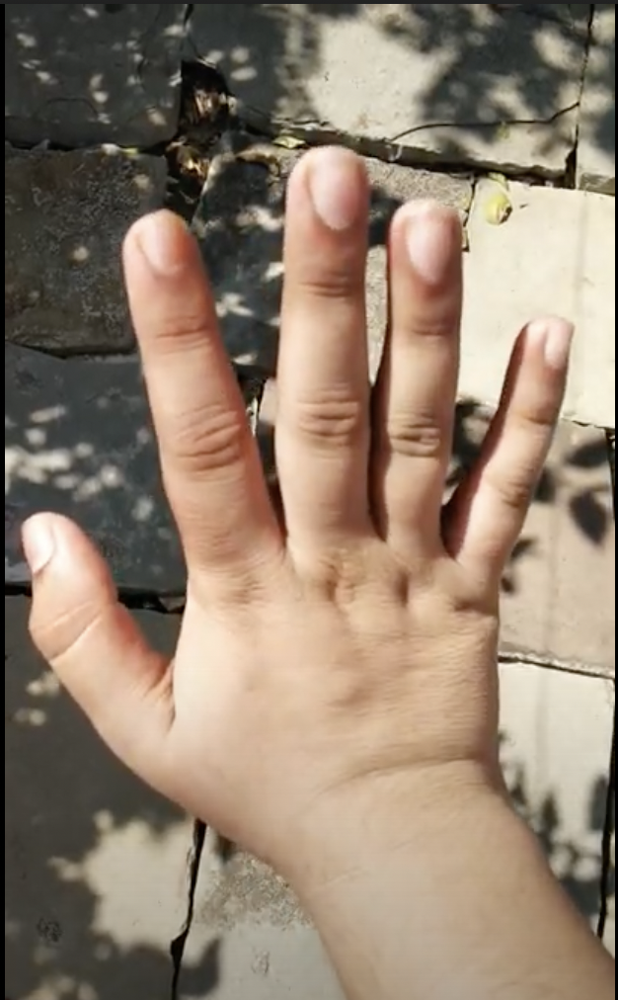
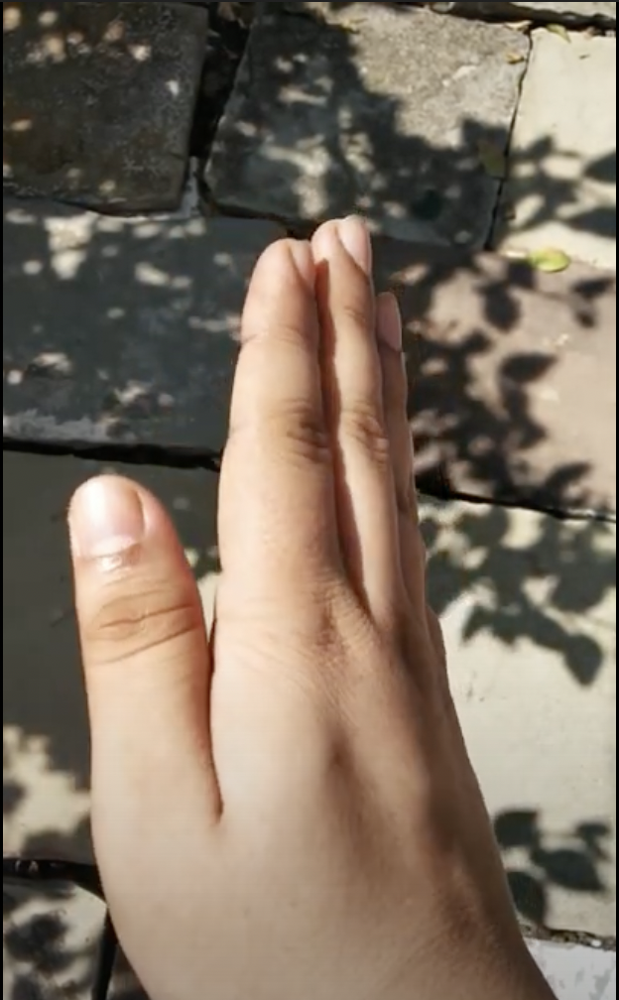
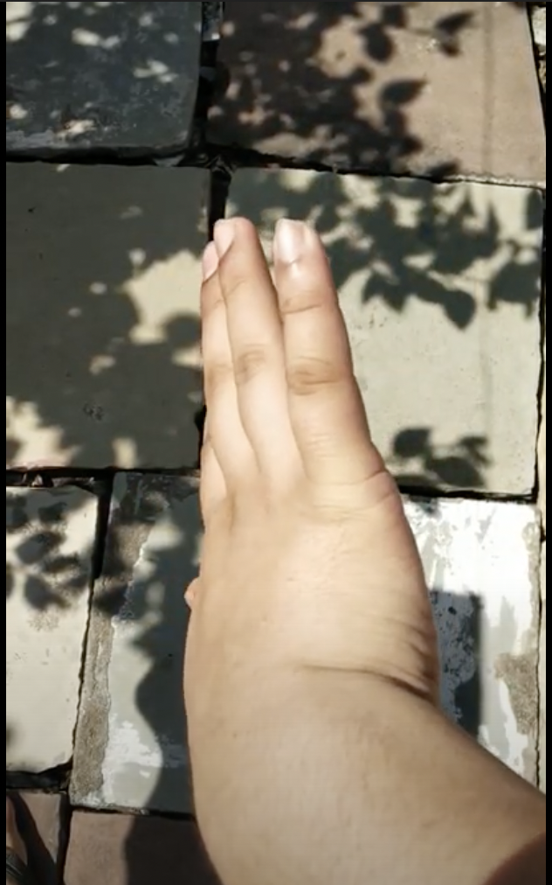
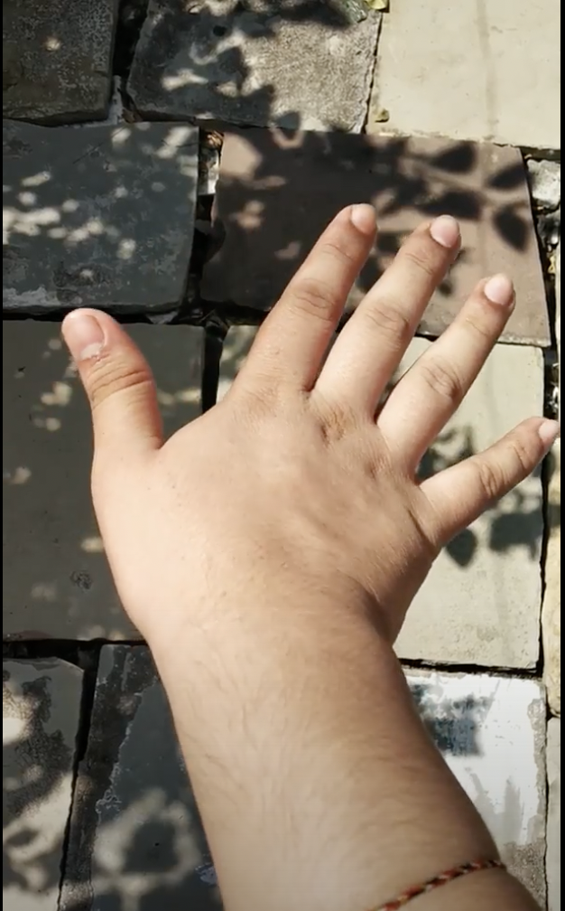
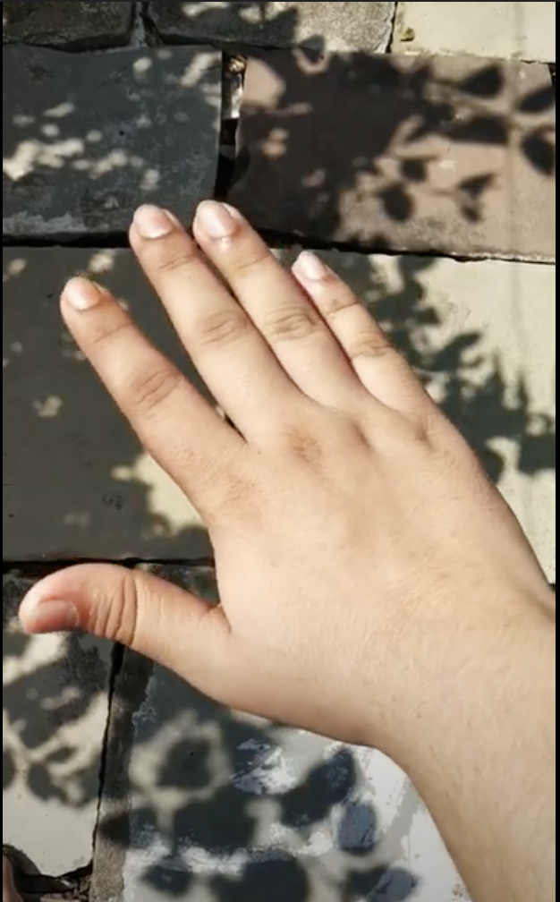
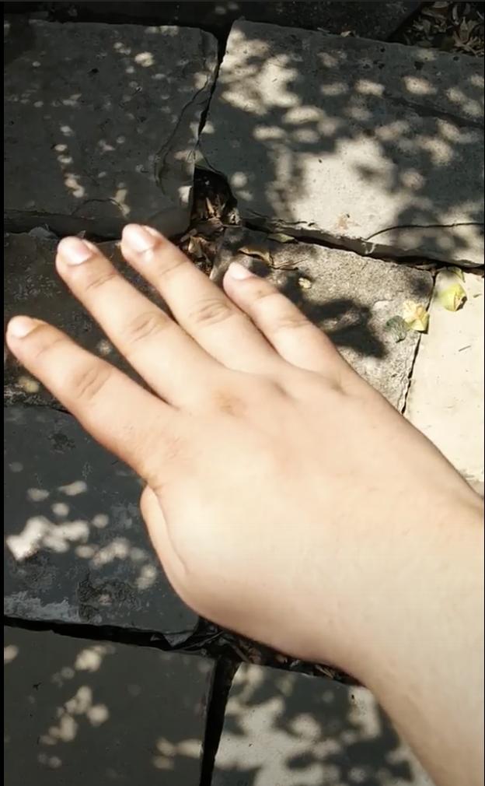
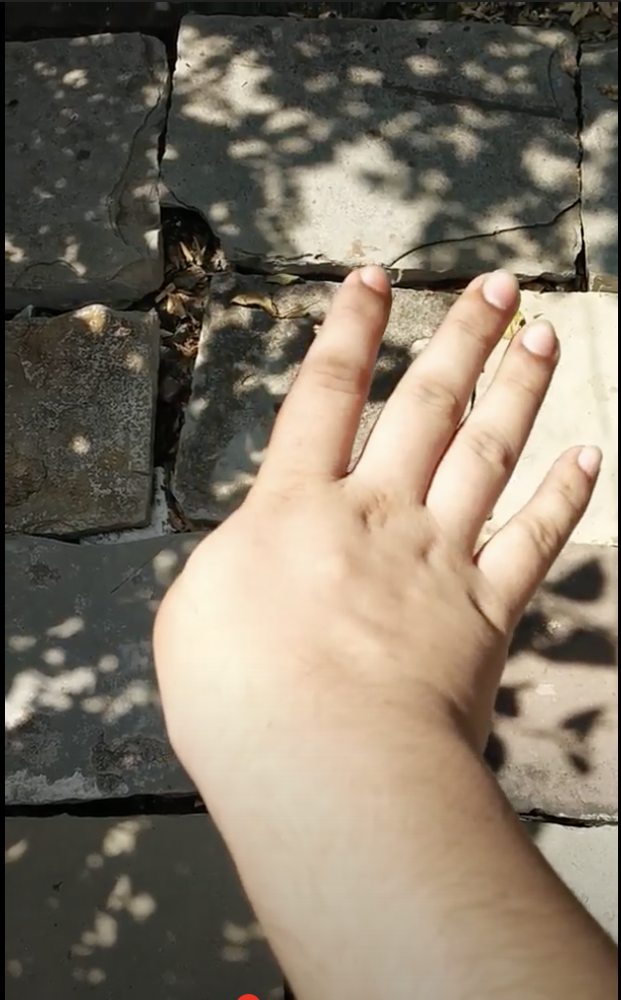
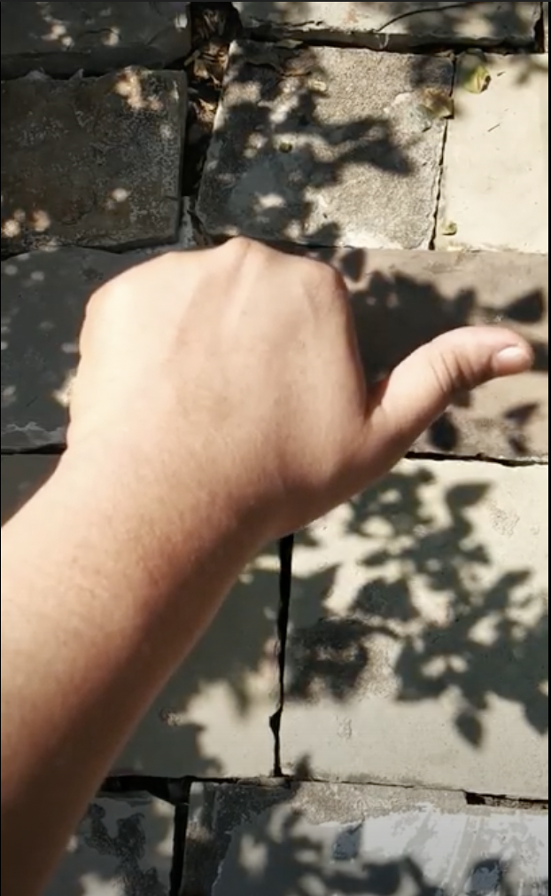
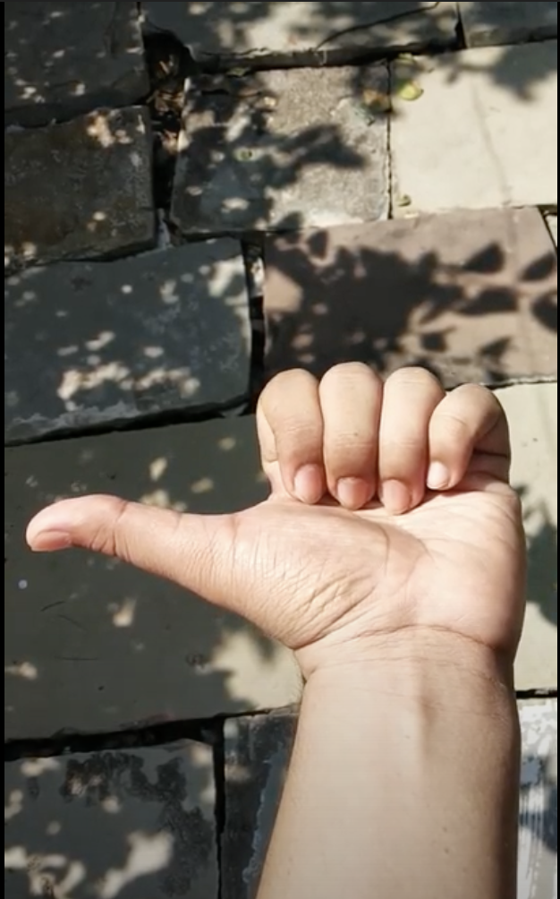

# Gesture Controlled Drone

## Introduction :

This project is based on gesture control. In this project a drone will be controlled by the hand gestures of a user. It is handled by the DSC ML Team of NIT Patna.

- **Why this project ?**

  The gestures elicit a close personal connection with content and enhance the sense of direct manipulation of objects. Gesture controls allow you to navigate without touching any physical buttons.

- **Needs of the project :**
  We require students having experience in ML we also require the ‘App development’ team to develop an app for our project and ‘Hardware team’ to build a drone simulator.

## How it works :

The ML model would be fed with the pre-defined gestures which would produce signals as output. These signals would be transmitted to the drone in order to perform the required manoeuvre.

## Tasks Involved :

- Gathering Data
- Data Exploration and Profiling
- Data Preprocessing
- Splitting the data into training and testing sets
- Choosing the ML model
- Training the model
- Evaluating the model
- Parameter tuning
- Developing a drone simulator
- Testing the model on the simulator

## Dataset

The data in this dataset is collected by the GDSC ML department and has been preprocessed to remove the outliers, missing and inaccurate data. The preprocessed data was then further splitted into training and testing sets. You can explore this dataset [here.](https://drive.google.com/drive/folders/1wP0D8qColtJyKpnJexIN_Qfrp-cZpvQB?usp=sharing)

## Gestures

Following gestures are required to fully control the drone :

| Movement       | Gesture                                                                             |
| -------------- | ----------------------------------------------------------------------------------- |
| North          |          |
| South          |          |
| East           |           |
| West           |           |
| North East     |      |
| North West     |      |
| South East     |      |
| South West     |      |
| Speed Increase |  |
| Speed Decrease |  |

You can find video of gestures [here.](https://drive.google.com/drive/folders/16gRxcGkjr_TiNS_cZ31QjPYy01w1bbWs?usp=sharing)

## Simulator

In order to simulate the performance of our ML model in real world we needed a drone simulator. It has been developed using Unity Engine where you can control the drone by taking output of the ML model as an input in the simulator. You can find the exe build of the simulator [here.](https://drive.google.com/file/d/1sUan_-f3Hw_wgs0o9t56jX1qf-1iYGne/view?usp=sharing)

## Accuracy

| Model Name   | Accuracy Acheived |
| ------------ | ----------------- |
| CNN          | 98.66%            |
| LSTM         | 93.42%            |
| CNN and LSTM | 98.73%            |

## Maintainers of the project

Project Lead : 
- [Raj Kothari](https://github.com/rajkothari634)
- [Sai Durga Kamesh Kota](https://github.com/ksdkamesh99)
- [Aparna Juhi](https://github.com/AparnaJuhi)

Team Members : 
- [Bhanu Pandey](https://github.com/)
- [Neeraj Patil](https://github.com/Neeraj2212)
- [Digvijay Srivastava](https://github.com/dig9074vijay)
- [Shivam Tyagi](https://github.com/ShivamTyagi12345)
